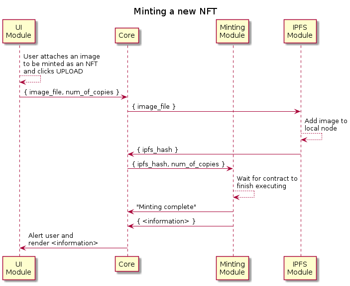

# NiFTy-Smart-Contract

Initial recipe borrowed from [nft-mix](https://github.com/PatrickAlphaC/nft-mix). 

## Dependencies


- [Brownie](https://github.com/eth-brownie/brownie#installation)
- [ganache-cli](https://github.com/trufflesuite/ganache#command-line-use) 

## Prerequisites 

- An account with [Infura](https://infura.io/)
- Some kind of wallet (e.g. [Metamask](https://metamask.io/)) to accept test tokens from a [faucet](https://faucets.chain.link)


## Building 

This won't run out of the box. The contracts must be compiled first: 

```
$ brownie compile 
``` 

## Running 

The test run requires `WEB3_INFURA_PROJECT_ID` and `PRIVATE_KEY` env vars to execute. They are defined in the `.env` file:

```
# .env
export WEB3_INFURA_PROJECT_ID="your project's ID string" 
export PRIVATE_KEY="your wallet's private key (don't let anyone else see this)"
```

```
$ source .env 
```


Once properly set-up, run `main.py` to test it out: 

``` 
$ ./main.py
testing...
Transaction sent: 0x304ad3fb15bb42869de79a61721858eb157d5f4674dac0f796743eabac354c83
  Gas price: 1.000000015 gwei   Gas limit: 2017541   Nonce: 16
  ArtistPicture.constructor confirmed   Block: 9610829   Gas used: 1834129 (90.91%)
  ArtistPicture deployed at: 0x3c16fb87AE40997fC46082B12FDB243F9FA0A564

Transaction sent: 0x247711b1550cf588d46b505ca51e0e6168d441cae51f6630d3a56018c12462c3
  Gas price: 1.000000014 gwei   Gas limit: 279320   Nonce: 17
  ArtistPicture.createCollectible confirmed   Block: 9610830   Gas used: 253928 (90.91%)

Minting complete: https://testnets.opensea.io/assets/0x3c16fb87AE40997fC46082B12FDB243F9FA0A564/<Transaction '0x247711b1550cf588d46b505ca51e0e6168d441cae51f6630d3a56018c12462c3'>
```

I've pinned a couple of different metadata files to be tested out: 
- https://ipfs.io/ipfs/QmPwpUKU1KAxbuTCNBCLfE6N4EPWvyY7g2oBCjfLvtHvof?filename=picture.json (this is already the default)
- https://ipfs.io/ipfs/QmPhJ3LYLc7u3AGzbNEvPaa9TWAVuPkUtv7GCNmoRjUVgJ?filename=tree.json (an image of a binary tree)


## IMPORTANT: Tell git to Ignore `.env` file modifications 

*Answer pulled from [here](https://stackoverflow.com/questions/936249/how-to-stop-tracking-and-ignore-changes-to-a-file-in-git/40272289#40272289)*

If you modify your `.env` file to run demos, git is going to complain about it having uncommitted changes despite it being listed in `.gitignore`:

```
$ git status
On branch development
Your branch is up to date with 'origin/development'.

Changes not staged for commit:
  (use "git add <file>..." to update what will be committed)
  (use "git restore <file>..." to discard changes in working directory)
	modified:   .env

no changes added to commit (use "git add" and/or "git commit -a")
```

Tell git that you want to keep your own version of the file without polluting the repository (you definitely don't want your wallet's private key showing up on the repo):

```
$ git update-index --skip-worktree .env
```

## Diagrams for Future Deliverables 

See [docs/README.md](docs/README.md). 

## Projected Project Structure 

### Components Overview 

 

### Miniting Process 


