# `ui_example.py`

This script launches a Tkinter window to interactively mint an NFT. 

## Prerequisites 

Ensure that your `.env` file is set up properly: 
- `PRIVATE_KEY`: this is your Ethereum wallet private key. See [quickstart](./quickstart.pdf). 
- `WEB3_INFURA_PROJECT_ID`: your Infura project ID. See [quickstart](./quickstart.pdf).
- `PINATA_API_KEY`: your Pinata API key. See next subsection. 
- `PINATA_API_SECRET`: your Pinata API secret. See next subsection. 

### Pinata keys 

Go to Pinata and log in. Click on the profile drop-down and click on *API KEYS*:

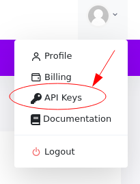

Click on the *New Key* button, enable **pinFileToIPFS** and **pinJSONToIPFS** radio buttons, give your API key a name, and then click *Create Key*:

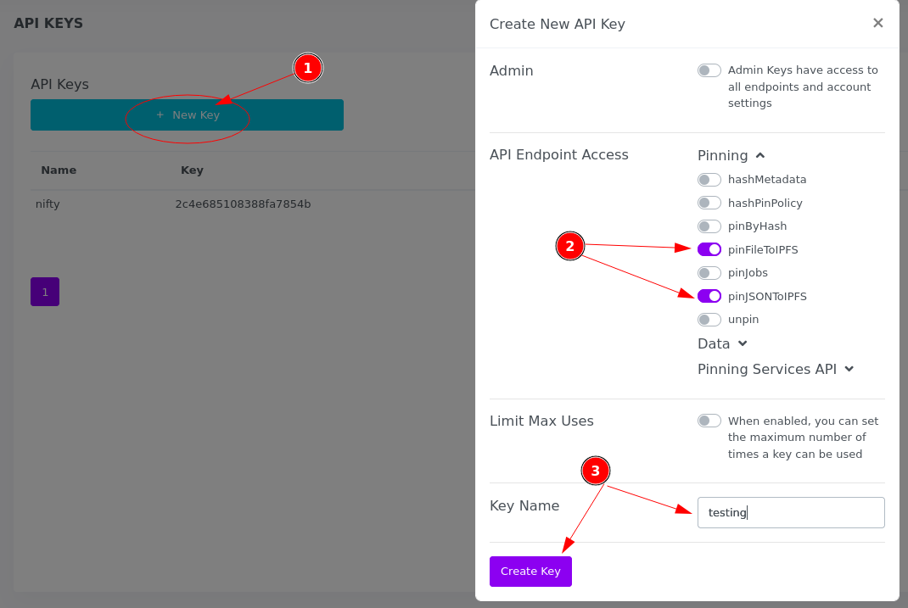

**Save everything** you see in the next dialog. It'll only be seen once: 

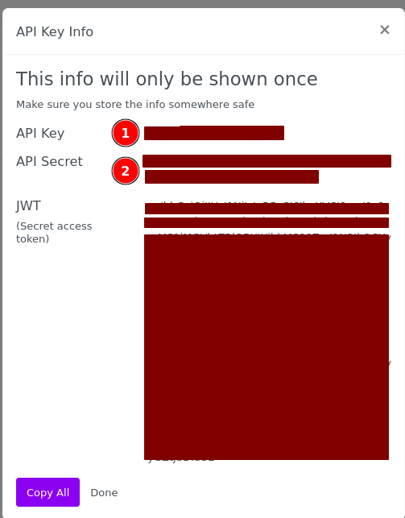 

Of interest for our program are **API Key** and **API Secret**. Copy those under `PINATA_API_KEY` and `PINATA_API_SECRET` respectively. 

## Source the Brownie environment 

If you installed Brownie via `pipx`, you'll have to do some extra work to get the UI example running. 

Run `pipx list` to see where your virtual environment is installed at. For me, it's under `~/.local/pipx/venvs/eth-brownie`:

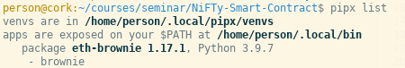

Run `source /path-to-venv/eth-brownie/bin/activate` to source the virtualenv: 

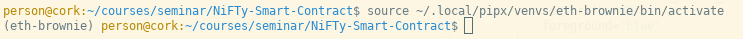

Once you see `(eth-brownie)` in your prompt, you're good to go. 

## Running the UI example 

Simply type `python ./ui_example.py` to start the UI: 

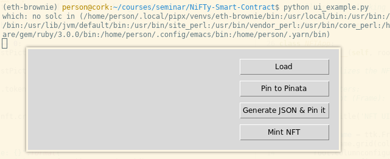

The buttons are laid out in a sequential order. *Please* don't click them out of order. 

First, click **Load** and find the image you want: 

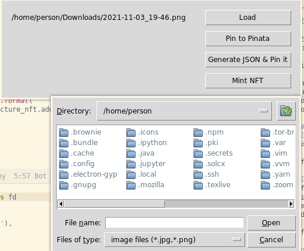

Then, click on **Pin to Pinata**. This may take a while: 

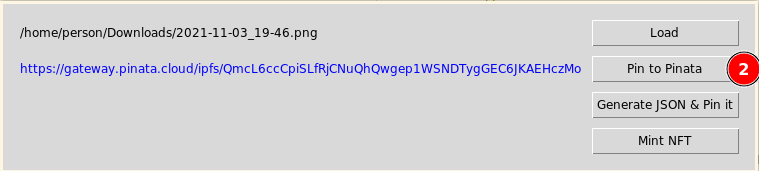

Then, click on **Generate JSON & Pin it**. This also may take a while: 

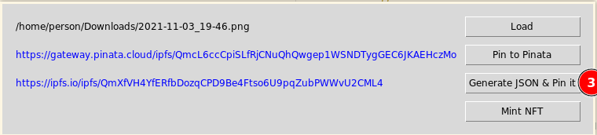

Finally, click on **Mint NFT**. This _will_ take a while, as in several seconds or more: 

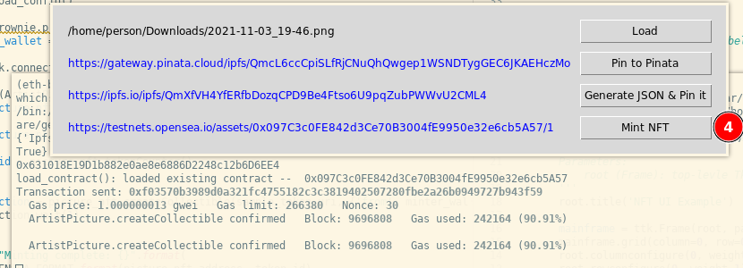

All URL labels clickable. The OpenSea URL might require a while to load since it relies on getting information directly from the testnet blockchain:

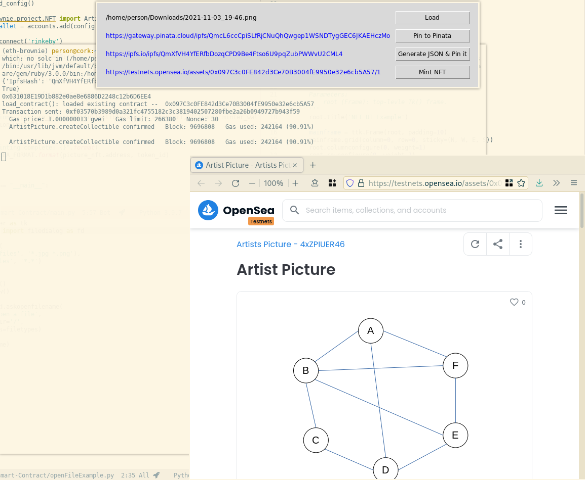
